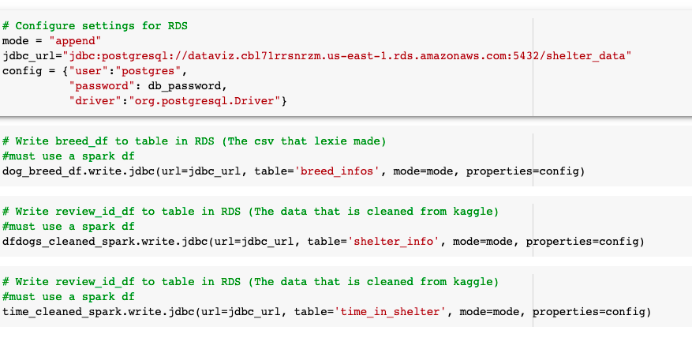

# Animal Shelter Outcomes
Predicting animal shelter outcomes based on a variety of factors.

[Data Cleaning, Database Integration, and Machine Learning Code](https://colab.research.google.com/drive/1Un2MgIWUsBedLOZDFTpyvPWIyqe16Unh?usp=sharing)

[Project Presentation](https://docs.google.com/presentation/d/1a7zfN7VgvrSrF3aFa70R0-m_T7dB8SmHga_wAXInP_U/edit?usp=sharing)

[Link to Dashboard](https://public.tableau.com/app/profile/lexie.walla/viz/FinalProject-AnimalShelterOutcomes/Story1?publish=yes "Link to Dashboard")

### Roles: 
Chloe has taken the role of working on database connection, Hussan worked with cleaning the data and the machine learning model, and Lexie is creating the visualizations. All team members will split the role of the presentation and dashboarding. 

## Outline of Project 
Many animals end up in shelters for various reasons across the country. Therefore, the goal of this project is to predict the likelihood of a successful animal adoption based on an animal’s characteristics. 

#### Dataset
The dataset is sourced from Kaggle and features both cats and dogs with various characteristics out of shelters in Austin Texas. To simplify this dataset, it is filtered to show just information on dogs. Columns that do not have much impact on the outcome are dropped (such as if they are neutered/spayed which occurs upon adoption). Using given date columns, the number of days a dog has lived is also calculated. Another dataset was created by our group to provide the shelter data with more breed-specific information such as the life span of certain dog breeds and their size. These two datasets are then joined using an inner join on the dog breed column.

#### Database
The raw data is initially loaded into an AWS S3 bucket and then using spark, the data file is read in and converted into a dataframe. The data is cleaned and upon completion it is written into SQL tables in the RDS instance. Once the data is written to the database, it is read back from using spark and the tables are joined into one using pandas. Below is an image showing data being written to the database:

#### Machine Learning Model 
To generate predictions a neural network model is used as there are many independent factors that are influencing the outcome to account for. This method is used in hopes of creating a model that when a given animal is input into a shelter, it can predict if it will get adopted or not given its unique characteristics. This will help shelter owners know which animals to focus adoption efforts on assisting and it will also inform the public as to which dogs tend to need a home. 

#### Visualization
The visualizations are completed using a story board in tableau to display all of the breed's and different characteristics we took into account to determine adopability of dogs. Some of the characteristics we analyzed were size, gender and age. We graphed the different sizes vs outcomes, average age vs outcomes, and gender vs outcomes. The dahsboard shows for size, the medium dogs were more successful than large or small. The average age of the dog to get adopted was 2 years old and that males are more likely to be adopted over females. 

[Link to Dashboard](https://public.tableau.com/app/profile/lexie.walla/viz/FinalProject-AnimalShelterOutcomes/Story1?publish=yes "Link to Dashboard")

